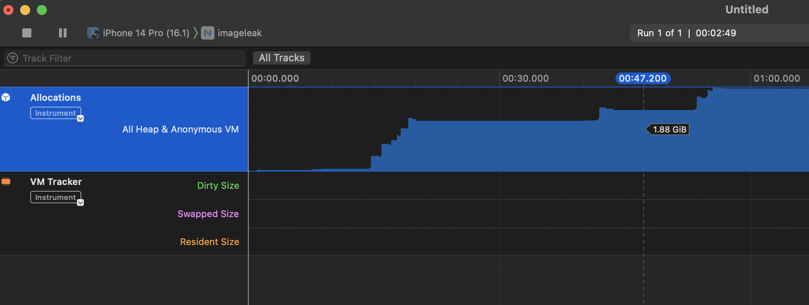

# ImageSource.fromAsset Memory Leak
Calling `ImageSource.fromAsset(image)` in the simulator or on a real devices causes the app to leak memory. Each image adds 400MB of memory in the simulator and about 100MB on a real device. The framework does not release the memory.

See file (https://github.com/atabix/nativescript-image-leak/blob/main/app/main-view-model.ts#L49); method `handleImages`

